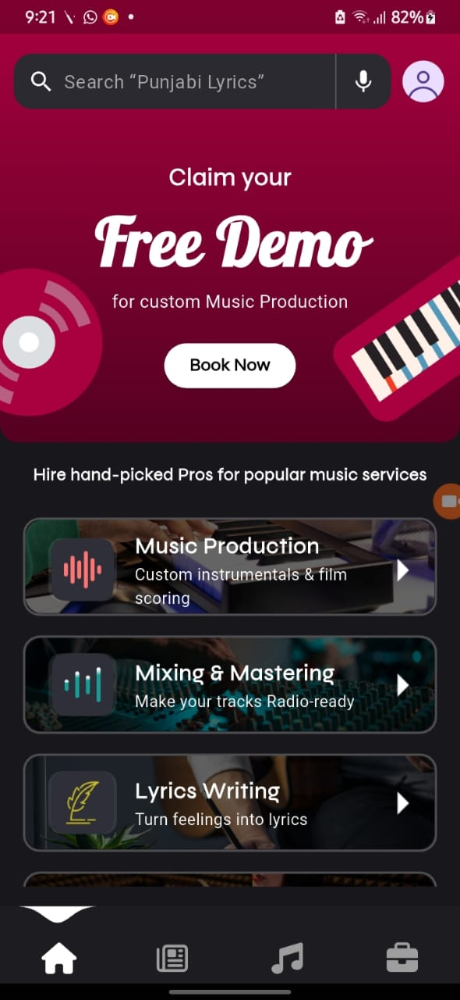

# S.Rocks.Music Services App 🛠️🎵

A Flutter-based single-screen module for a music service booking app, built as part of the Flutter Developer Intern assignment for S.Rocks.Music. This screen fetches music-related services (e.g., Music Production, Instrument Repair) from Firebase Firestore and displays them in a responsive card layout using MVVM architecture.

## 📂 Project Architecture: MVVM (Model-View-ViewModel)

### 🔍 View (UI Layer)
- Displays the list of service cards with icon, title, and description.
- Handles user interaction (tap to navigate to detail screen).
- Example: `HomeScreen`, `ServiceCardWidget`

### 🧠 ViewModel (Logic + State Layer)
- Manages state using Provider.
- Fetches data from the Repository.
- Holds loading/error/data logic.
- Example: `ServiceViewModel` (notifies listeners on data change)

### 🗂️ Model (Data Layer)
- Defines the data structure for a service (title, description, icon).
- Handles JSON serialization for Firestore.
- Example: `MusicServiceModel` (with fromMap/toMap methods)

## ✅ Features

- 🔥 Firebase Firestore integration for service data.
- 📱 Responsive UI built from Figma design.
- 🧭 Navigation to detail screen on card tap.
- 🪄 Clean MVVM separation.
- 📦 Provider-based state management.

## 📸 Screenshots

### Home Screen

### Tapped Service Example

